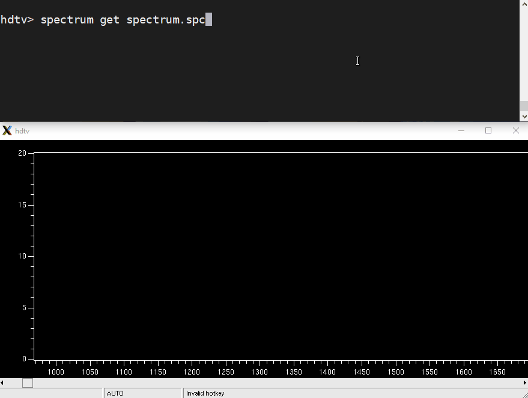

# HDTV - Nuclear Spectrum Analysis

[](https://badge.fury.io/py/hdtv)
[](https://codecov.io/gh/janmayer/hdtv)
[](https://app.codacy.com/manual/janmayer/hdtv/dashboard)



HDTV is a nuclear spectrum and coincidence matrix analysis tool.
It can load uncompressed (text), compressed, and ROOT spectra and 2D-matrices.
It calibrates spectra, fits peaks with background with different models, and cuts matrices.
HDTV is written in a mixture of C++ and Python, glued together using PyROOT.


## Installation

HDTV requires [CERN ROOT](https://root.cern.ch/) with working Python bindings.

```sh
pip install hdtv
```

If pip raises `error: externally-managed-environment`,
you can install hdtv in a virtual environment,
for example by using `pipx`:

```sh
pipx install hdtv --system-site-packages
```

If you use hdtv with a location-independent ROOT installation
(i.e., you have to `source <...>/thisroot.sh`, e.g. in `.bashrc` or manually),
you can leave out the `--system-site-packages` option.

Please note that the python package (wheel) does currently not include the compiled libraries required to run, as these depend on the root version, the python version, the compiler, and the moon phases.
Instead, these are compiled automatically at first start, which requires certain build tools (see below).

Alternatively, the compilation can be triggered with
```sh
hdtv --rebuild-usr
```
for the current user; or with
```sh
hdtv --rebuild-sys
```
for all user (requires superuser privileges).


### Requirements
To build and run HDTV, the following dependencies are required:

* Python
    - Tested with 3.9, 3.10, 3.11, and 3.12
    - Python-dependencies are installed automatically when using pip/pipx
        - Packages: numpy scipy matplotlib prompt_toolkit>=3.0.14 uncertainties (when manually installed)
        - Packages for development & testing: docutils pytest pytest-cov
* [Cern ROOT](https://root.cern/) 6
    - Tested with version 6.26 and higher
    - Needs to be compiled against the correct python version and with support for C++14 or higher.
    - In python, **`import ROOT` must succeed**.
    - System packages may be available on some systems, e.g. `<tool> install root python3-root` ([More info](https://root.cern/install/#linux-package-managers))
* cmake, gcc, g++ (or similar, in a somewhat modern version)
* libx11-dev `<tool> install libx11-6 libx11-dev`

### Usage with docker

With docker installed, build the image with:

```sh
git clone https://github.com/janmayer/hdtv.git
cd hdtv
docker build --tag hdtv .
```

On Linux and MacOS, no further installation is required and in the directory with your project you will be able to use HDTV with:

```sh
docker run -e DISPLAY=${DISPLAY} -v /tmp/.X11-unix:/tmp/.X11-unix -v $(pwd):/work -it hdtv
```

When using SELinux, the additional argument `--security-opt label=type:container_runtime_t` is required (before `-it`).

On Windows, you will need to have an X-Server installed, for example with MobaXTerm, and be a bit more specific:

```sh
docker run -e DISPLAY=<your ip>:0.0 -v <full path to your files>:/work -it hdtv
```

e.g. `docker run -e DISPLAY=192.168.178.21:0.0 -v D:\Project\Spectra:/work -it hdtv`.

See also [https://hub.docker.com/r/rootproject/root](https://hub.docker.com/r/rootproject/root).

## Documentation
For more information, including an overview of the available key
bindings, refer to the [documentation](doc/guide/hdtv.rst).
A [tutorial](doc/guide/hdtv-tutorial.rst) giving an introduction
to HDTV and its basic features is also available.


## Further installation topics

### Run locally from source directory without installation

```
git clone https://github.com/janmayer/hdtv.git
cd hdtv
./bin/hdtv
```

Generate man pages:

```
cd doc/guide
make doc
```


### Handling different ROOT versions

HDTV uses `ROOT.gSystem.Load(libary)` to load some critical
components. These need to be compiled against the *exact* ROOT
version imported in python. HDTV will try to automatically recompile
the libraries for the current ROOT if the available ones cannot
be loaded. This can also be forced with:

`hdtv --rebuild-usr`

When installed system-wide, the libraries can be recompiled once for
all users with:

`hdtv --rebuild-sys`

This eliminates the need to reinstall HDTV after changes to the root
installation.

Multiple Versions of ROOT can be used alongside, the correct library
version will be chosen automatically.
